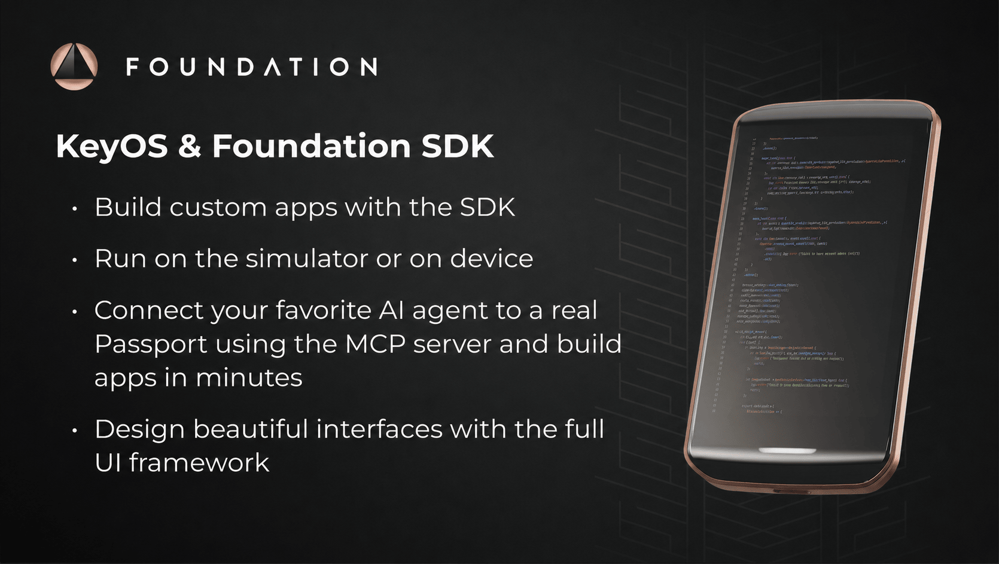

<!--
SPDX-FileCopyrightText: 2023-2026 Foundation Devices, Inc. <hello@foundation.xyz>
SPDX-License-Identifier: GPL-3.0-or-later
-->

# KeyOS



**KeyOS is Foundation's open-source operating system and app platform for
Passport Prime.** It combines a Rust-based, message-passing microkernel, fully
sandboxed apps, declarative permissions, a curated Slint UI library, and
device services for secure, offline-first apps.

This repository contains the KeyOS source code, Foundation-built apps, the
Foundation SDK, simulator, and the tools used to build and verify KeyOS
releases.

[Developer portal](https://foundation.xyz/developers) ·
[Developer documentation](https://docs.foundation.xyz/developers/home/) ·
[App showcase](https://foundation.xyz/app-showcase)

> The Foundation SDK is currently in public beta. You can build and test an app
> in the simulator without a Passport Prime.

## Build apps for Passport Prime

Passport Prime is an open developer platform for building secure, offline-first
apps in Rust. KeyOS apps are full Rust binary crates with their own UI, storage,
and declared permissions; they are not skins of an existing app.

Through declared permissions, apps can use KeyOS services and device
capabilities including the touchscreen, camera, NFC, USB-C, secure storage,
a hardware secure element, and QuantumLink post-quantum Bluetooth. The
Foundation SDK gives app developers:

- A single `foundation` CLI for project creation, builds, previews, simulation,
  signing, logs, and sideloading.
- A curated Slint UI library and visual theme editor.
- A hosted KeyOS simulator for development without a device.
- Templates for single-page, routed, and component-gallery apps, with shared
  UI, themes, resources, permission manifests, and publisher metadata.
- Guidance and tools for AI-assisted development.
- An MCP server for testing on a real Passport Prime through screenshots,
  touch input, logs, and app launch controls.

The SDK release matrix supports Apple Silicon macOS (`aarch64-apple-darwin`),
Intel macOS (`x86_64-apple-darwin`), x86_64 Linux
(`x86_64-unknown-linux-gnu`), and ARM64 Linux
(`aarch64-unknown-linux-gnu`). Windows via WSL2 is supported using the
corresponding Linux package. Nix provides the pinned Rust toolchain,
cross-compiler, simulator, Slint tools, and signing utilities.

### Quick start

Install the current SDK release:

```sh
curl -sSfL https://sdk.foundation.xyz/latest/install.sh | bash
```

On NixOS or systems where shell startup files are managed by Home Manager,
disable the automatic `PATH` update and add the SDK launcher to your managed
shell configuration instead:

```sh
curl -sSfL https://sdk.foundation.xyz/latest/install.sh | FOUNDATION_SDK_UPDATE_RC=0 bash
```

Once the SDK is installed, later releases are installed with the CLI itself,
which runs the same installer:

```sh
foundation update
```

Restart your shell or follow the installer's printed `PATH` instructions, then
verify the environment:

```sh
foundation doctor
```

If `foundation doctor` reports that Nix is missing, install Nix using the
Determinate Nix Installer, which enables flakes by default:

```sh
curl --proto '=https' --tlsv1.2 -sSf -L \
  https://install.determinate.systems/nix | sh -s -- install
```

Restart your shell, then run `foundation doctor` again. You do not need to
install Rust or the KeyOS cross-compiler separately.

Enter the SDK development shell and create an app:

```sh
foundation develop
foundation new my-app
cd my-app
foundation sim
```

The required positional argument to `foundation new` is the app name. In an
interactive session it lets you choose a template and collects the display
names, description, publisher and support metadata, app ID, app version, and
minimum KeyOS version. The default template is a working single-page app. For a
routed app or a component gallery, start with:

```sh
foundation new my-app --template multi-page-app
foundation new component-lab --template kitchen-sink
```

See the [developer documentation](https://docs.foundation.xyz/developers/home/)
for the full setup guide, KeyOS architecture, app layout, capabilities, and API
reference.

## Build with an AI coding agent

Projects created by `foundation new` are ready for agent-assisted development:

- `AGENTS.md` tells an agent how to use the SDK safely and which validation
  workflow to follow.
- `.mcp.json` registers the bundled `foundation-passport-drive` MCP server for
  compatible clients.
- The SDK includes Codex and Claude skills for the `foundation` CLI,
  localization, and adding routed pages.
- The app's Rust, Slint, configuration, translations, and resources remain
  ordinary source files that you can inspect and review.

Open the generated project in your preferred coding agent and describe the app
you want. A useful first request is specific about the UI, behavior, and
validation:

```text
Build a two-page KeyOS app for tracking recovery checks.
Use the SDK's existing Slint components and localization system.
Preview the UI, then run the complete app in the simulator.
Do not create signing keys or use connected hardware without asking me first.
```

A productive development loop is:

1. Ask the agent to make a small change in Rust, Slint, translations, or app
   configuration.
2. Use `foundation preview` for fast UI-only checks.
3. Use `foundation sim` to exercise callbacks, navigation, permissions, and
   hosted KeyOS services.
4. Review the diff and simulator result.
5. When you choose to test hardware, connect a Passport Prime and use
   `foundation sideload` or the MCP tools.

The SDK also includes two agent slash workflows. These are prompt workflows,
not CLI commands:

- `/foundation-localize <source-locale> <target-locale>` updates a translation
  while preserving keys and placeholders.
- `/foundation-new-page <name>` adds and wires a routed Slint page when the
  project's structure makes the insertion point clear.

### Test on a real Passport Prime

Unlock Passport Prime, enable USB, connect it over USB-C, and turn on
**Settings > Apps > Developer Mode**. The generated `.mcp.json` lets a
compatible agent start the local `passport-drive` MCP connection and, with your
direction:

- Capture screenshots.
- Inject taps, swipes, and text input.
- Read logs and clear the local MCP log buffer.
- Inspect the KeyOS version and process list.
- Upload, launch, and close a development app.

Every device app is signed. If you do not already have a publisher identity,
create one as an intentional, one-time setup step:

```sh
foundation cert gen "My Publisher"
```

This creates long-lived private signing material under
`~/.foundation/signing/`. Protect it and never commit it to an app repository.
Install the matching public certificate on the connected device:

```sh
foundation cert install "My Publisher"
```

It will appear under **Settings > Apps > Trusted Publishers**. The app can be
uploaded without this certificate, but KeyOS will not launch it until the
publisher is trusted.

For the standard build-and-run path, use:

```sh
foundation sideload
```

This builds and signs the app, uploads the bundle over the USB debug channel,
checks that a trusted-publisher certificate is installed, and asks the device
to launch it. KeyOS accepts the launch only when the app's signer matches a
trusted certificate. Use `foundation sideload --no-run` to upload without the
pre-launch trust check or launch request.

Developer Mode intentionally grants powerful local debugging access. Keep the
MCP server local, connect only trusted clients, keep PINs, seed words, and
private signing material out of prompts and logs, and disable Developer Mode
when you are finished.

The same MCP server also exposes trusted-certificate installation, kernel and
memory commands, reboot-to-bootloader, flash read/write/verify, and HID APDU
operations. They are outside the normal app workflow and can change device
state. Approve hardware tool calls individually, and authorize these low-level
operations only when you have separately requested that specific hardware or
system-software work.

## Foundation CLI at a glance

`foundation build`, `foundation sim`, and `foundation sideload` require the SDK
shell started by `foundation develop`; the other commands below can run outside
it.

| Command | Purpose |
| --- | --- |
| `foundation doctor` | Check SDK and app build readiness. |
| `foundation docs [sdk-version] [--url]` | Open the complete static docs bundle from an installed SDK, or print its URL; choose the KeyOS API version in the page. |
| `foundation new <name>` | Create an app from an SDK template. |
| `foundation theme` | Edit the current app's visual theme. |
| `foundation preview ui/app.slint` | Preview the Slint UI without a full app run. |
| `foundation sim` | Build and run the app in the hosted KeyOS simulator. |
| `foundation build` | Produce and sign a device app bundle. |
| `foundation sideload` | Build, upload, and launch the app on Passport Prime. |
| `foundation logs` | View logs from a connected Passport Prime. |
| `foundation cert gen <name>` | Create a local publisher signing identity. |
| `foundation cert install <name>` | Trust that publisher certificate on a connected Passport Prime. |

Maintainers: see [SDK API documentation bundles](docs/sdk-api-docs.md) for the crate allowlist,
KeyOS-version snapshot configuration, packaging, and publication contract.

For command behavior and agent safety guidance, see the
[Foundation CLI agent guide](sdk/docs/foundation-cli.md). SDK maintainers should
also read the [Foundation SDK maintainer README](sdk/SDK-README.md).

## Inside a KeyOS app

A generated app keeps its important pieces explicit:

| Path | What it controls |
| --- | --- |
| `app-config.toml` | App identity, version, publisher, icon, theme, permissions, and signing configuration. |
| `permission_templates.toml` | Named capability sets expanded into the app manifest. |
| `src/main.rs` | Rust entry point, state, service calls, and UI callback wiring. |
| `ui/` | Slint components, pages, navigation, and generated UI bindings. |
| `i18n/` | Translation strings. |
| `resources/` | App icon, theme, images, fonts, and other local assets. |
| `AGENTS.md` | Project-specific guidance for AI coding agents. |
| `.mcp.json` | Local Passport Prime MCP server configuration. |

Palladium, the KeyOS microkernel, runs each app in an isolated process with its
own address space and storage scope. Apps call KeyOS services through
kernel-mediated message passing, and Palladium enforces the permissions
resolved into the app's signed manifest. Hardware access, private storage,
secure-element operations, and trusted system prompts remain mediated by KeyOS
services.

Read more about the
[KeyOS security model](https://docs.foundation.xyz/developers/keyos/) and
[app capabilities](https://docs.foundation.xyz/developers/capabilities/).

## Repository guide

Most app developers should use an installed SDK instead of building this whole
monorepo. These directories are useful when exploring KeyOS or contributing to
the platform:

- [`sdk`](sdk) — Foundation SDK source, CLI, simulator packaging, app templates,
  examples, documentation, and release tooling.
- [`apps`](apps) — Foundation-built KeyOS apps and practical implementation
  references.
- [`api`](api) — Client crates through which apps use KeyOS services.
- [`server`](server) — Typed message-passing IPC helpers for KeyOS servers and
  clients.
- [`slint-keyos-platform`](slint-keyos-platform) — Slint runtime integration,
  routing, localization, and build support.
- [`ui`](ui) and [`ui2`](ui2) — Shared UI components and resources for built-in
  apps and the SDK-facing component surface.
- [`utils/passport-drive`](utils/passport-drive) — USB CLI and MCP server used
  for real-device development.
- [`os`](os), [`boot`](boot), [`loader`](loader), and [`xtask`](xtask) — KeyOS
  system services, secure boot flow, loader, image builder, and release tooling.
- [`xous`](xous) — Palladium microkernel sources; the directory retains its
  historical Xous name.

## Develop and verify KeyOS

Foundation engineers and contributors working on the operating system,
bootloader, built-in apps, or release tooling should start with
[`DEVELOPMENT.md`](DEVELOPMENT.md). It covers the Nix environment, complete
KeyOS system builds, simulator workflows, tests, formatting, and repository
conventions.

To rebuild an official release and compare its verifiable artifacts, follow
[`REPRODUCIBILITY.md`](REPRODUCIBILITY.md). It documents the pinned build
environment, release artifact layout, hash comparison, and the parts of the
secure boot image that cannot be compared byte-for-byte.

## Open source

KeyOS is written primarily in Rust. Its Palladium microkernel is Foundation's
extensively modified evolution of the open-source
[Xous](https://github.com/betrusted-io/xous-core) project, while the KeyOS UI
stack builds on [Slint](https://slint.dev/). Foundation-built apps in this
repository are useful architecture and implementation references, but the
public SDK exposes a curated API and UI surface; some in-tree apps use internal
interfaces.

## Responsible disclosure

Please report suspected security vulnerabilities privately through Foundation's
[responsible disclosure and bug bounty program](https://foundation.xyz/responsible-disclosure).
Do not create a publicly viewable issue or include seed phrases, private keys,
wallet passwords, or other sensitive data in a report.

## Licensing

This repository uses [REUSE](https://reuse.software/) metadata. Each file's SPDX
header, or the applicable entry in [`.reuse/dep5`](.reuse/dep5), identifies its
license. Corresponding license texts are available in [`LICENSES`](LICENSES).

This repository contains code and assets under multiple licenses, including
copyleft and permissive licenses. Consult the SPDX/REUSE metadata for the files
you use, modify, or distribute; do not assume that one license applies to the
entire repository.
