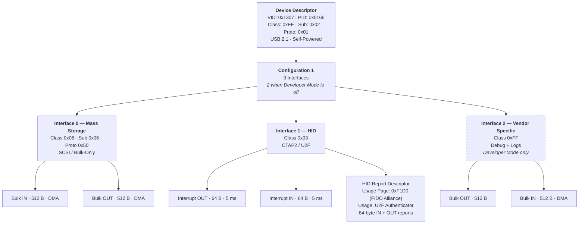
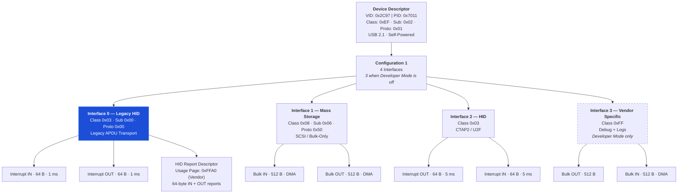
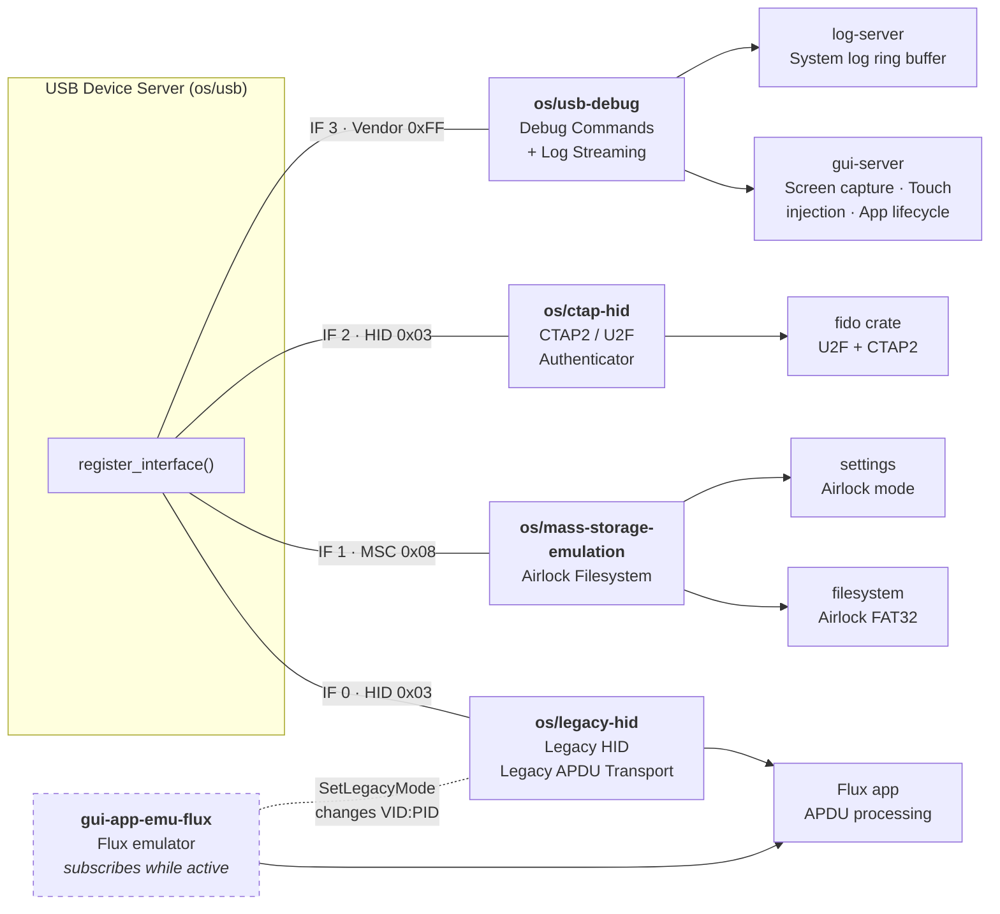
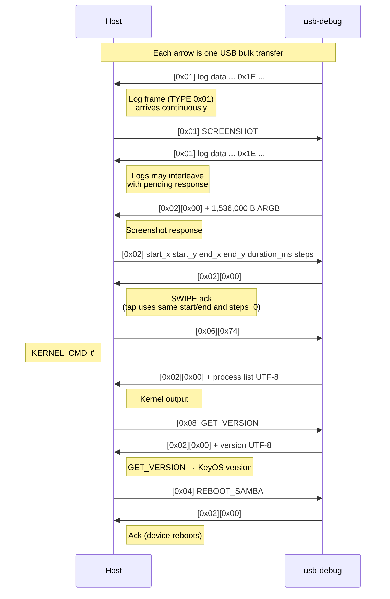

# Passport Prime USB Interface Architecture

Passport Prime presents itself as a USB 2.1 composite device with a single
configuration. Each USB-facing KeyOS server registers one interface with the
central USB device server (`os/usb`).

| Field | Value |
|-------|-------|
| VID:PID | `0x1307:0x0165` |
| Device Class | `0xEF` (Miscellaneous / IAD) |
| Manufacturer | Foundation Devices, Inc. |
| Product | Passport Prime |
| Max Power | 32 mA (self-powered) |

Each KeyOS server calls `register_interface()` with a fixed interface priority.
Priorities are ordering keys, not identifiers: `os/usb` numbers the enabled
interfaces contiguously from zero in priority order, so `bInterfaceNumber` is a
position in the current configuration descriptor and shifts as interfaces are
enabled and disabled. `bInterfaceNumber` has to index an array of
`bNumInterfaces`, so a disabled interface cannot be allowed to leave a gap.
Class-specific setup responders are attached to interface registration and are
routed by `wIndex` against that interface number. Endpoint numbers are
allocated by `os/usb` when interfaces register, so diagrams below list endpoint
types and directions rather than treating endpoint numbers as protocol constants.

The interface numbers in the diagrams below are the numbers for the configuration
each diagram shows.

When Developer Mode is disabled, the debug interface is omitted from the active
configuration descriptor and the device re-enumerates without it.

## USB Descriptor Tree — Normal Mode, Developer Mode Enabled



> Interface 2 (dashed) is only visible at runtime when Developer Mode is enabled.
> Legacy HID is absent outside Legacy Mode. Mass Storage only registers after the
> first unlock, before which the interfaces below it each move down by one.

## USB Descriptor Tree — Legacy Mode (Flux Emulator Active)

When a Flux app launches, `gui-app-emu-flux` asks `os/legacy-hid` to switch the
device to the Legacy Flux VID:PID. Legacy HID has the lowest priority, so it is
Interface 0 whenever it is enabled, and the interfaces above it move up by one
as it appears: Mass Storage 1, CTAP HID 2, and usb-debug 3 when Developer Mode
is enabled. The interface is enabled before the identity switch, so both steps
trigger a USB disconnect / re-enumeration. When the Flux app exits, the normal
identity is restored (two more re-enumerations).



> The Legacy HID interface (blue) is Interface 0 whenever Legacy Mode is active,
> because it has the lowest priority. The Legacy VID:PID is what makes host
> wallets (e.g. MoneroGUI) treat it like a real Legacy Flux.

## KeyOS Server Mapping



> `os/legacy-hid` registers its interface disabled at startup. Flux activation
> enables it, toggles the USB identity and subscribes to inbound APDUs; without a
> subscriber, inbound APDUs are dropped.

---

## USB-Debug Interface — Protocol Reference

The vendor-specific debug interface (class `0xFF`) carries both debug commands and
system logs on a single pair of bulk endpoints. It is only present when the
`usb-debug` service is built and Developer Mode is enabled.

**Source files:**
- Shared protocol: `os/usb-debug/protocol/src/lib.rs`
- Device side: `os/usb-debug/src/main.rs`, `os/usb-debug/src/dispatch.rs`
- Host transport: `os/usb-debug/protocol/src/client.rs`
- Host load-app helper: `utils/passport-drive/src/load_app.rs`

### Frame Format

Each frame is a single USB bulk transfer, terminated by a short packet or ZLP.

**Host to Device (OUT endpoint):**

```
┌──────┬────────────────────┐
│ CMD  │ PAYLOAD (0..N)     │
│ 1 B  │                    │
└──────┴────────────────────┘
```

**Device to Host (IN endpoint):**

Log frames and debug responses are multiplexed on the same IN endpoint, distinguished
by a 1-byte TYPE prefix.

```
TYPE 0x01 — Log data:
┌──────┬─────────────────────────────────────┐
│ 0x01 │ UTF-8 log bytes (0x1E-terminated)   │
│ 1 B  │                                     │
└──────┴─────────────────────────────────────┘

TYPE 0x02 — Debug response:
┌──────┬────────┬──────────────────────┐
│ 0x02 │ STATUS │ Response data (0..N) │
│ 1 B  │ 1 B    │                      │
└──────┴────────┴──────────────────────┘
  STATUS: 0x00 = OK, 0x01 = Error, 0x02 = Locked
```

### Command Table

| Byte | Name | Payload (Host → Device) | Response (Device → Host) |
|------|------|-------------------------|--------------------------|
| `0x01` | `SCREENSHOT` | — | 1,536,000 bytes (480 x 800 x 4, ARGB8888) |
| `0x02` | `SWIPE` | `start_x start_y end_x end_y duration_ms steps` (11 B; u16 LE fields + u8 steps) | Ack (empty) |
| `0x03` | `POWER_BTN` | 1 B: `0x00` = short press, else = long press | Ack (empty) |
| `0x04` | `REBOOT_SAMBA` | — | Ack, then device reboots into SAM-BA |
| `0x05` | `CLOSE_APP` | `pid_lo pid_hi` (2 B LE) | Ack (empty) |
| `0x06` | `KERNEL_CMD` | 1 B: command character (see below) | Kernel debug output (variable) |
| `0x07` | `INPUT_TEXT` | UTF-8 text bytes | Ack (empty) |
| `0x08` | `GET_VERSION` | — | UTF-8 KeyOS version bytes |
| `0x09` | `LAUNCH_APP` | 16-byte AppId | `pid_lo pid_hi status` (3 B; status `0` launched, `1` already running) |
| `0x0A` | `GET_DEVELOPER_MODE` | — | 1 B: `0` disabled, `1` enabled |
| `0x0B` | `LOAD_APP_BEGIN` | 16-byte AppId | Ack (empty) |
| `0x0C` | `LOAD_APP_FILE_BEGIN` | expected size as 8 B LE + UTF-8 relative filename | Ack (empty) |
| `0x0D` | `LOAD_APP_CHUNK` | File bytes, max 65,534 B per chunk | Ack; final chunk closes current file |
| `0x0E` | `LOAD_APP_END` | — | Ack (empty) |
| `0x0F` | `GET_PROCESS_LIST` | — | Compact process list output |

`SWIPE` injects a press at the start coordinate, `steps` drag events spread over
`duration_ms`, then a release at the end coordinate. Host-side `tap` is encoded
as `SWIPE` with identical start/end coordinates and `steps = 0`. Screen
coordinates use origin top-left, 480 x 800 pixels; the virtual button strip can
extend below the LCD in host tooling.

`LOAD_APP_BEGIN` deletes/replaces `keyos/sideloaded-apps/<app-id>` and opens an
upload session. Each file is sent as `LOAD_APP_FILE_BEGIN`, then `LOAD_APP_CHUNK`
frames until the declared size is reached; the final chunk flushes and promotes
the current `.part` file. Host tooling sends a ZLP after any max-packet-aligned
OUT command so the device can use larger DMA reads without losing command
boundaries. Filenames are relative paths such as `app.elf`, `manifest.json`,
`icon.bin`, or `resources/<path>`. `LOAD_APP_END` refreshes app-manager's
installed app registry.

In production builds, the device rejects `REBOOT_SAMBA` and `KERNEL_CMD`.
`CLOSE_APP` and the `LOAD_APP_*` commands additionally check Developer Mode
and/or device lock state in the dispatcher.

### Kernel Debug Sub-Commands (CMD `0x06`)

| Char | Description |
|------|-------------|
| `h` | Help / command list |
| `i` | IRQ statistics |
| `m` | MMU state |
| `p` | Process list (verbose) |
| `t` | Process list (compact) |
| `s` | Server list |
| `c` | Cache statistics |
| `a` | AppID to PID mapping |
| `o` | Memory ownership |
| `k` | Consistency check |

### Wire Protocol — Sequence Diagram



**Log retention:** The `log-server` keeps a **16 KB ring buffer** that overwrites
old entries unconditionally — there is no backpressure to writers. When a host tool
connects, its `LogReader` receives up to 16 KB of the most recent logs already in
the ring, then streams new logs going forward. If the host stops draining (or
disconnects), the reader's position is eventually lapped by the write pointer and
the intermediate logs are silently lost. In practice this means that after extended
uptime you will see the last ~16 KB of log output on connect and everything before
that is gone.

---

See [Legacy Mode HID: Wallet-Compatible APDU Interface](legacy-mode-hid.md) for
the full protocol reference on the Legacy-compatible HID interface used by Flux apps.

---

## Host-Side Tools

Two checked-in tools communicate with the USB-debug interface from the host.

### passport-drive

**Location:** `utils/passport-drive/`

A Rust CLI and MCP (Model Context Protocol) server for driving Passport Prime
over USB. It is the most feature-complete host tool.

- **Transport:** `usb-debug-protocol`'s `DebugClient` (`rusb` under the
  `client` feature). Auto-detects the vendor-specific interface (class `0xFF`)
  by iterating the USB config descriptor. A background reader thread demuxes IN
  frames into separate `log_rx` and `resp_rx` channels.
- **Debug commands used:** All device debug commands (`0x01`–`0x0F`) through the
  CLI and MCP server.
- **MCP tools over the debug interface:** `connect`, `disconnect`, `get_logs`,
  `clear_logs`, `screenshot`, `tap`, `swipe`, `power_button`,
  `send_kernel_command`, `reboot_to_samba`, `input_text`, `close_app`,
  `load_app`, `launch_app`, `get_developer_mode`, `get_version`,
  `get_process_list`.
- **Additional capabilities:**
  - Device discovery: `list_ports`.
  - SAM-BA bootloader mode: flash read / write / verify (via `sambuca` crate).
  - HID APDU exchange: CTAP/FIDO mode (normal VID:PID, usage page `0xF1D0`) and
    Legacy mode (VID `0x2C97`, usage page `0xFFA0` on Interface 0).

**MCP tools for SAM-BA mode:** `samba_list_devices`, `samba_connect`,
`samba_disconnect`, `samba_version`, `samba_read_u32`, `samba_write_u32`,
`samba_init_flash`, `samba_flash_info`, `samba_read_flash`,
`samba_write_flash`, `samba_verify_flash`, `samba_reboot`.

**MCP tool for HID APDU:** `send_apdu`.

### keyos-log-viewer

**Location:** `utils/keyos-log-viewer/`

A Rust TUI application built with `ratatui` for real-time log streaming, filtering,
and search.

- **Transport:** the shared `usb-debug-protocol` `DebugClient`, with the same
  vendor interface auto-detection. Auto-reconnects on device disconnect.
- **Debug commands used:** `0x06` only (`KERNEL_CMD` with character `'t'` for
  compact process list snapshots).
- **Log parsing:** Accumulates bytes from TYPE `0x01` frames, splits on `0x1E`
  record terminators.

### foundation CLI (SDK)

**Location:** `sdk/crates/cli/`

The SDK CLI for Flux app developers.

- **`foundation logs`** — Launches `keyos-log-viewer` as a subprocess (no direct
  USB usage).
- **`foundation sideload`** — Builds and signs the app, then uploads the signed
  bundle (`app.elf`, `manifest.json`, required `icon.bin`, and optional
  `resources/`) through the `passport-drive` MCP `load_app` tool. The SDK
  package stages that helper as `foundation-passport-drive`.
- **Debug commands used:** `0x0A` for Developer Mode preflight; `0x0B`–`0x0E`
  for usb-debug app upload; and, unless `--no-run` is passed, `0x09` to launch
  the installed app via the `passport-drive` MCP server.

### Tool Command Matrix

| Capability | passport-drive | keyos-log-viewer | foundation sideload |
|------------|:-:|:-:|:-:|
| `0x01` SCREENSHOT | x | | |
| `0x02` SWIPE / tap | x | | |
| `0x03` POWER_BTN | x | | |
| `0x04` REBOOT_SAMBA | x | | |
| `0x05` CLOSE_APP | x | | |
| `0x06` KERNEL_CMD | x | x | |
| `0x07` INPUT_TEXT | x | | |
| `0x08` GET_VERSION | x | | |
| `0x09` LAUNCH_APP | x | | x |
| `0x0A` GET_DEVELOPER_MODE | x | | x |
| `0x0B` LOAD_APP_BEGIN | x | | x |
| `0x0C` LOAD_APP_FILE_BEGIN | x | | x |
| `0x0D` LOAD_APP_CHUNK | x | | x |
| `0x0E` LOAD_APP_END | x | | x |
| `0x0F` GET_PROCESS_LIST | x | | |
| Log Streaming (TYPE 0x01) | x | x | |
| SAM-BA Flash R/W | x | | |
| HID APDU (CTAP + Legacy) | x | | |

---

## Alternative USB Identities

| Mode | VID:PID | When |
|------|---------|------|
| Normal | `0x1307:0x0165` | Standard boot, no Flux app running |
| Legacy | `0x2C97:0x7011` | While the Flux emulator is on screen (Legacy Flux identity) |

The device switches between identities at runtime. When a Flux app launches,
`gui-app-emu-flux` calls `LegacyHidApi::set_legacy_mode(true)`; `os/legacy-hid`
then calls `set_custom_vid_pid(0x2C97, 0x7011)` and the USB bus re-enumerates
with the Legacy Flux identity. When the Flux app exits, the normal VID:PID is
restored and the bus re-enumerates again. Each transition is visible to the host
as a USB disconnect followed by a new device appearing.

The product id's high byte (`0x70`) is the model marker the host reads; the bare
`0x0007` is the bootloader identity, which modern host stacks refuse to exchange
APDUs with. Present `0x70xx` (the low byte is a USB-interface bitmask the host
ignores) so the device is seen as app-mode.

The host tools try the normal VID:PID first, then fall back to the Legacy one.
